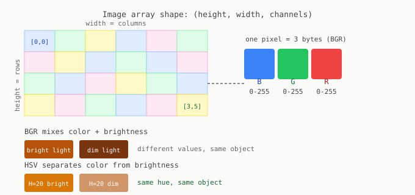

# Chapter 1: How Computers See

Before writing any computer vision code, you need a precise mental model of what you are working with. Almost every subtle bug traces back to a fuzzy understanding of the underlying data structure.

---

## An image is a NumPy array

When OpenCV loads an image, you get a three-dimensional NumPy array:

```python
import cv2
import numpy as np

img = cv2.imread('cookie_bag.jpg')
print(img.shape)   # (480, 640, 3)
print(img.dtype)   # uint8
```

Shape `(480, 640, 3)` means 480 rows, 640 columns, 3 channels. A 640x480 color image contains exactly 921,600 numbers. Everything your algorithms do is arithmetic on those numbers.

```
img.shape  =  (height, width, channels)
               480      640      3

img[row, col]  not  img[x, y]    <- vertical comes first
```

---

## The BGR channel order

OpenCV stores channels in **BGR order**, not RGB. This is a historical accident that was never corrected. The practical consequence: if you pass an OpenCV image to matplotlib or to any function that expects RGB, colors will be wrong with no error message.

```python
plt.imshow(img)                                    # wrong: BGR treated as RGB
plt.imshow(cv2.cvtColor(img, cv2.COLOR_BGR2RGB))   # correct
```

The fine-tuned model later in this book was trained on BGR images. Feed it an RGB image and detection accuracy drops noticeably, silently.

---

## Memory layout



Each pixel is three consecutive bytes in memory: Blue, Green, Red. Rows are stored sequentially. When you slice `img[100:200, 50:150]` you get a contiguous block of memory covering rows 100-199, columns 50-149.

---

## Pixel values

In a `uint8` image, 0 is black and 255 is white. For computation (neural network input, gradients, division) convert to `float32`:

```python
img_float = img.astype(np.float32) / 255.0
```

YOLOv8 does this conversion internally. OpenCV functions expect `uint8`. Mixing the two without explicit conversion produces silently wrong results.

---

## Color spaces

BGR mixes color and brightness together. The same golden-brown cookie can produce very different BGR values under dim lighting versus bright lighting.

**HSV** separates them:

| Channel | Range (OpenCV) | What it encodes |
|---------|---------------|-----------------|
| Hue | 0 to 179 | Pure color, lighting-independent |
| Saturation | 0 to 255 | How vivid vs washed-out |
| Value | 0 to 255 | Brightness |

```python
hsv = cv2.cvtColor(img, cv2.COLOR_BGR2HSV)
```

A golden-brown cookie has Hue around 15-25 in bright light and in dim light. The same object has very different Blue and Red values across those conditions. That is why HSV thresholding is more robust for color-based detection.

---

## The depth image

The RealSense D435 publishes a second image alongside color: the depth map.

```python
depth = cv2.imread('depth.png', cv2.IMREAD_UNCHANGED)
print(depth.shape)    # (480, 640)    single channel
print(depth.dtype)    # uint16
print(depth[240, 320])  # e.g. 445   means 445mm from camera
```

Each pixel is distance in **millimeters**. Pixel value 0 means no return. Over the transparent cookie bag, nearly every pixel is 0.

To get metres, divide by 1000. Forgetting this is the most common bug in the back-projection pipeline.

```python
depth_metres = depth.astype(np.float32) / 1000.0
```

---

## The `cv2.imread` None trap

```python
img = cv2.imread('cookie_bag.jpg')
assert img is not None, "Image not loaded, check your path"
```

When a file is not found, `cv2.imread` returns `None` silently. No exception. Calling `.shape` on `None` gives a confusing `AttributeError` that looks like an array bug but is actually a path bug. The assert catches it immediately.

---

## Summary

```python
img   = cv2.imread('cookie_bag.jpg')
assert img is not None

# img.shape = (height, width, 3), dtype uint8, channel order BGR

hsv   = cv2.cvtColor(img, cv2.COLOR_BGR2HSV)
gray  = cv2.cvtColor(img, cv2.COLOR_BGR2GRAY)
img_f = img.astype(np.float32) / 255.0

depth = cv2.imread('depth.png', cv2.IMREAD_UNCHANGED)
depth_m = depth.astype(np.float32) / 1000.0
```

---

[Prev: Prologue](00_prologue.md) | [Next: Chapter 2](02_color_and_masking.md)
