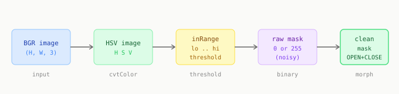

# Chapter 2: Color and Masking

The simplest question in computer vision: where is the object? The simplest answer, when conditions allow it: find the pixels with the right color.

This chapter builds a binary mask. White pixels mark the object. Black pixels mark everything else. Every chapter after this builds on that mask.

---

## What a mask is

A mask is a single-channel `uint8` image, same size as the source, where each pixel is 0 (background) or 255 (object).

```python
mask = np.zeros((480, 640), dtype=np.uint8)
```

Once you have a clean mask, the object's centroid is trivial:

```python
ys, xs = np.where(mask > 0)
u = int(xs.mean())
v = int(ys.mean())
```

---

## HSV thresholding

Convert to HSV, then call `cv2.inRange` with a lower and upper bound:

```python
import cv2
import numpy as np

img = cv2.imread('cookie_bag.jpg')
assert img is not None

hsv  = cv2.cvtColor(img, cv2.COLOR_BGR2HSV)

lower = np.array([10,  50,  50])   # H_min  S_min  V_min
upper = np.array([30, 255, 255])   # H_max  S_max  V_max

mask = cv2.inRange(hsv, lower, upper)
```

Every pixel where H, S, V all fall inside the range becomes 255. Everything else becomes 0.

**Finding your values:** display the HSV image, click on the object, read back the values at that pixel. Set the Hue range to plus or minus 10 of your target. Start S and V both from 30 to 255.



---

## Morphological cleanup

The raw mask always has noise. Two types:

- **Salt noise:** isolated white pixels in the background (reflections, debris)
- **Pepper noise:** holes inside the object region (shadows, highlights)

Fix both with morphological operations using a small kernel:

```python
kernel = np.ones((5, 5), np.uint8)

mask = cv2.morphologyEx(mask, cv2.MORPH_OPEN,  kernel)  # removes small noise blobs
mask = cv2.morphologyEx(mask, cv2.MORPH_CLOSE, kernel)  # fills holes inside object
```

**Opening** = erode then dilate. Kills isolated blobs smaller than the kernel.
**Closing** = dilate then erode. Fills holes smaller than the kernel.

Always run both, in that order.

---

## Complete pipeline

```python
def color_mask(image_path, lower_hsv, upper_hsv, kernel_size=5):
    img = cv2.imread(image_path)
    assert img is not None

    img     = cv2.resize(img, (640, 480))
    blurred = cv2.GaussianBlur(img, (5, 5), 0)
    hsv     = cv2.cvtColor(blurred, cv2.COLOR_BGR2HSV)
    mask    = cv2.inRange(hsv, lower_hsv, upper_hsv)

    k    = np.ones((kernel_size, kernel_size), np.uint8)
    mask = cv2.morphologyEx(mask, cv2.MORPH_OPEN,  k)
    mask = cv2.morphologyEx(mask, cv2.MORPH_CLOSE, k)

    return img, mask


lower = np.array([10,  50,  50])
upper = np.array([30, 255, 255])

img, mask = color_mask('cookie_bag.jpg', lower, upper)

coverage = mask.sum() / 255 / mask.size * 100
print(f"Object coverage: {coverage:.1f}% of frame")
```

---

## Why this fails on transparent packaging

Run this on a cookie in a transparent bag. The mask will be mostly black.

The transparent bag has no distinctive hue. It reflects whatever is behind it. There is no color range to threshold on. This is a fundamental limitation, not a tuning problem.

Chapter 6 explains why deep learning is the right tool for this specific failure. Chapters 7 to 9 build the solution.

---

## Summary

```python
hsv  = cv2.cvtColor(img, cv2.COLOR_BGR2HSV)
mask = cv2.inRange(hsv, lower_hsv, upper_hsv)

k    = np.ones((5, 5), np.uint8)
mask = cv2.morphologyEx(mask, cv2.MORPH_OPEN,  k)
mask = cv2.morphologyEx(mask, cv2.MORPH_CLOSE, k)

ys, xs = np.where(mask > 0)
u, v   = int(xs.mean()), int(ys.mean())
```

---

[Prev: Chapter 1](01_how_computers_see.md) | [Next: Chapter 3](03_geometry_from_shapes.md)
