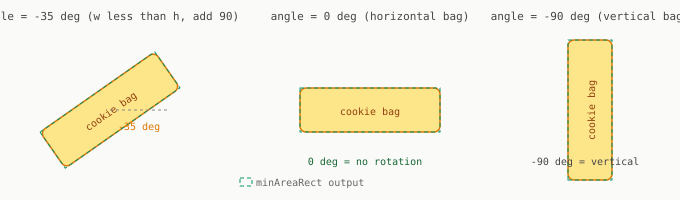

# Chapter 3: Geometry from Shapes

A centroid tells you where an object is. It says nothing about how it is rotated. For a gripper to close around an elongated bag it must approach at the right angle. Miss by 30 degrees and the gripper clips the edge.

This chapter extracts orientation from the mask using contour analysis and a rotated bounding box.

---

## Contours

A contour is an ordered sequence of pixel coordinates tracing the boundary of a white region in a binary mask.

```python
contours, hierarchy = cv2.findContours(
    mask,
    cv2.RETR_EXTERNAL,       # outer boundaries only
    cv2.CHAIN_APPROX_SIMPLE  # compress straight edges to endpoints
)
```

`RETR_EXTERNAL` returns only the outermost boundary per region. `CHAIN_APPROX_SIMPLE` stores a straight 400-pixel edge as 2 points instead of 400.

Filter by minimum area to remove noise:

```python
valid = [cnt for cnt in contours if cv2.contourArea(cnt) > 500]
```

---

## Centroid from moments

```python
M  = cv2.moments(cnt)

if M['m00'] == 0:
    continue  # skip degenerate contour

cx = int(M['m10'] / M['m00'])   # centroid x (column)
cy = int(M['m01'] / M['m00'])   # centroid y (row)
```

`m00` is the total area. `m10` and `m01` are first moments. Dividing gives the center of mass.

---

## Orientation from `minAreaRect`

`cv2.minAreaRect` fits the tightest rotated rectangle around a contour:

```python
rect             = cv2.minAreaRect(cnt)
center, (w, h), angle = rect
```

`angle` is the rotation angle, always in range -90 to 0.

**Critical correction:** OpenCV defines angle as the rotation that brings the shorter side to horizontal. For an elongated bag you want the long axis angle. If `w < h`, add 90:

```python
if w < h:
    angle = angle + 90.0
```

After this correction, `angle = 0` means the long axis is horizontal, `angle = -45` means it is rotated 45 degrees clockwise.



---

## Aspect ratio

`min(w, h) / max(w, h)` ranges from 0 to 1:

| Value | Shape |
|-------|-------|
| 0.15 to 0.40 | Elongated bag |
| 0.50 to 0.80 | Roughly square bag |
| 0.85 to 1.00 | Compact or circular |

This gives you a free shape classifier without any machine learning.

---

## Complete pipeline

```python
def analyse_contours(img, mask, min_area=500):
    contours, _ = cv2.findContours(mask, cv2.RETR_EXTERNAL, cv2.CHAIN_APPROX_SIMPLE)
    detections  = []

    for cnt in contours:
        if cv2.contourArea(cnt) < min_area:
            continue

        rect = cv2.minAreaRect(cnt)
        _, (w, h), angle = rect
        if w < h:
            angle += 90.0

        M = cv2.moments(cnt)
        if M['m00'] == 0:
            continue

        cx = int(M['m10'] / M['m00'])
        cy = int(M['m01'] / M['m00'])

        detections.append({
            'centroid':     (cx, cy),
            'angle_deg':    round(angle, 2),
            'aspect_ratio': round(min(w, h) / max(w, h), 3),
        })

    return detections
```

---

## From angle to gripper rotation

The angle from `minAreaRect` is in the image plane. For a robot arm approaching from above, this angle maps directly to the gripper's yaw rotation before closing.

In Chapter 10 this angle is converted to a quaternion:

```python
from scipy.spatial.transform import Rotation
import numpy as np

rot = Rotation.from_euler('z', np.radians(angle_deg))
qx, qy, qz, qw = rot.as_quat()
```

---

[Prev: Chapter 2](02_color_and_masking.md) | [Next: Chapter 4](04_depth_and_backprojection.md)
