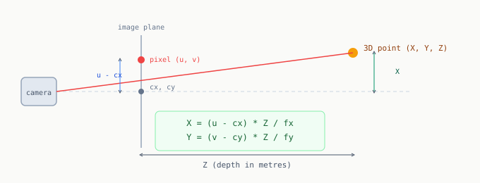

# Chapter 4: Depth and Back-Projection

The pixel coordinate `(u, v)` from Chapter 3 tells you where an object is in the image. It says nothing about where it is in the real world. To command a robot arm you need `(X, Y, Z)` in metres.

This chapter derives that 3D position from a pixel coordinate and a depth reading.

---

## How a depth camera works

The Intel RealSense D435 projects an infrared dot pattern onto the scene and captures its reflection. Nearby surfaces deform the pattern more than distant ones. The sensor measures the deformation and computes a distance per pixel.

**What breaks this:** transparent plastic transmits infrared light instead of reflecting it. The sensor gets no return signal and writes 0 into the depth buffer.

---

## Camera intrinsics

Every camera has a unique 2D-to-3D mapping described by four numbers:

| Symbol | Meaning |
|--------|---------|
| `fx`, `fy` | Focal lengths in pixels. Larger = more telephoto. |
| `cx`, `cy` | Principal point. Where the optical axis meets the image plane. Typically near the image centre. |

These come from the `/camera/color/camera_info` ROS topic. Read them once at startup:

```python
intrinsics = {
    'fx': msg.k[0],
    'fy': msg.k[4],
    'cx': msg.k[2],
    'cy': msg.k[5],
}
```

`msg.k` is a flat 9-element array representing the 3x3 camera matrix in row-major order.

---

## The back-projection formula

Given pixel `(u, v)` and depth `Z` in metres, the 3D point is:

```
X = (u - cx) * Z / fx
Y = (v - cy) * Z / fy
Z = Z
```

This is similar triangles. The pixel offset from the principal point `(u - cx)` is to `fx` as the real-world offset `X` is to depth `Z`.



```python
def pixel_to_3d(u, v, depth_m, intrinsics):
    """
    Back-project pixel (u, v) and depth to a 3D point in camera frame.
    depth_m must be in metres, not millimeters.
    Returns np.array([X, Y, Z])
    """
    fx = intrinsics['fx']
    fy = intrinsics['fy']
    cx = intrinsics['cx']
    cy = intrinsics['cy']

    X = (u - cx) * depth_m / fx
    Y = (v - cy) * depth_m / fy
    return np.array([X, Y, depth_m])
```

**Most common bug:** passing depth in millimeters instead of metres. Always divide by 1000 first.

---

## Getting reliable depth

A single pixel depth reading is fragile. Sample a small neighborhood and take the median of valid (non-zero) pixels:

```python
def get_depth_at(depth_img, u, v, patch_size=7, fallback_m=0.45):
    """
    Returns depth in metres at pixel (u, v).
    Uses median of a patch neighborhood to avoid noise and holes.
    Falls back to fallback_m if too many zero-depth pixels.
    """
    hole_ratio = (depth_img == 0).mean()
    if hole_ratio > 0.30:
        return fallback_m   # transparent object: use known bin depth

    half = patch_size // 2
    r0 = max(0, v - half);  r1 = min(depth_img.shape[0], v + half + 1)
    c0 = max(0, u - half);  c1 = min(depth_img.shape[1], u + half + 1)
    roi = depth_img[r0:r1, c0:c1]

    valid = roi[roi > 0]
    if len(valid) == 0:
        return fallback_m

    return float(np.median(valid)) / 1000.0
```

`fallback_m` is the distance from the camera lens to the bin floor, measured once with a tape. When the transparent bag returns no valid depth, the gripper is sent to approximately the right depth. Not perfect, but far better than returning 0.

---

## Sanity check

Before trusting a 3D point for robot control:

```python
def sanity_check_3d(point):
    X, Y, Z = point
    ok = (0.05 < Z < 2.0) and (abs(X) < Z) and (abs(Y) < Z)
    if not ok:
        print(f"Implausible: X={X:.3f} Y={Y:.3f} Z={Z:.3f}")
        print("Did you forget to divide depth by 1000?")
    return ok
```

`abs(X) > Z` is geometrically impossible given a normal field of view. If this fires, the depth was in millimeters.

---

## Full pipeline

```python
depth_m  = get_depth_at(depth_img, u, v, fallback_m=0.45)
point_3d = pixel_to_3d(u, v, depth_m, intrinsics)

if sanity_check_3d(point_3d):
    X, Y, Z = point_3d
    print(f"3D in camera frame: X={X:.4f} Y={Y:.4f} Z={Z:.4f} metres")
```

The result is in camera optical frame. Chapter 10 applies a TF2 transform to convert to the robot arm's coordinate frame.

---

[Prev: Chapter 3](03_geometry_from_shapes.md) | [Next: Chapter 5](05_point_clouds.md)
