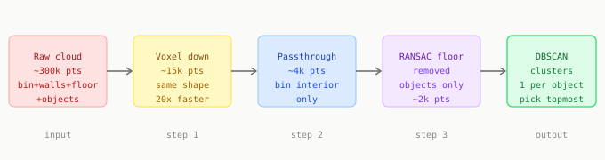

# Chapter 5: Point Clouds

Chapter 4 back-projected one pixel to one 3D point. A point cloud back-projects every pixel at once: a collection of hundreds of thousands of 3D coordinates representing every surface visible from the camera.

Point clouds give you something no 2D image can: actual geometry of the scene.

---

## Building a point cloud

```python
import open3d as o3d
import numpy as np

intrinsics = o3d.camera.PinholeCameraIntrinsic(
    width=640, height=480,
    fx=615.0, fy=615.0,
    cx=320.0, cy=240.0
)

depth_img = o3d.geometry.Image(depth_array.astype(np.uint16))

pcd = o3d.geometry.PointCloud.create_from_depth_image(
    depth_img,
    intrinsics,
    depth_scale=1000.0,   # divide raw values to get metres
    depth_trunc=1.5,      # discard points beyond 1.5m
)

print(f"Raw cloud: {len(pcd.points):,} points")
```

A 640x480 depth image can produce up to 307,200 points. The raw cloud contains everything: bin walls, floor, robot arm, and the objects you want.

---

## Three cleaning steps



**Step 1: Voxel downsampling**

Replaces every cluster of nearby points with one representative point. Reduces 300k points to roughly 15k with no meaningful loss of object geometry.

```python
pcd = pcd.voxel_down_sample(voxel_size=0.005)   # 5mm grid
```

**Step 2: Passthrough filtering**

Removes everything outside the known bin volume.

```python
def passthrough(pcd, axis, lo, hi):
    pts  = np.asarray(pcd.points)
    mask = (pts[:, axis] >= lo) & (pts[:, axis] <= hi)
    return pcd.select_by_index(np.where(mask)[0])

pcd = passthrough(pcd, axis=2, lo=0.20, hi=0.65)    # depth
pcd = passthrough(pcd, axis=0, lo=-0.22, hi=0.22)   # left-right
pcd = passthrough(pcd, axis=1, lo=-0.22, hi=0.22)   # up-down
```

**Step 3: RANSAC floor removal**

Finds and removes the dominant flat surface (the bin floor) without knowing where it is.

```python
plane_model, inliers = pcd.segment_plane(
    distance_threshold=0.01,
    ransac_n=3,
    num_iterations=1000
)

a, b, c, d = plane_model
assert abs(c) > 0.7, "RANSAC found a wall, not the floor"

items = pcd.select_by_index(inliers, invert=True)
```

If `c` is close to 1.0, the floor is horizontal as expected. If `c` is near 0, RANSAC found a wall instead. Tighten the passthrough bounds to exclude walls before this step.

---

## DBSCAN clustering

After floor removal, the remaining points are the objects. DBSCAN groups nearby points into clusters without requiring you to specify how many objects are present.

```python
labels = np.array(
    items.cluster_dbscan(eps=0.02, min_points=50)
)

n_clusters = labels.max() + 1 if labels.max() >= 0 else 0
print(f"Objects found: {n_clusters}")
```

`eps` is the neighbourhood radius in metres. If two nearby objects are merging into one cluster, decrease it. If one object is splitting into multiple clusters, increase it.

---

## Selecting the topmost object

```python
pts = np.asarray(items.points)

best, best_z = None, -np.inf
for cid in range(n_clusters):
    cluster_pts = pts[labels == cid]
    if len(cluster_pts) < 100:
        continue
    centroid = cluster_pts.mean(axis=0)
    if centroid[2] > best_z:
        best_z = centroid[2]
        best   = centroid

print(f"Pick target: {best}")
```

Highest Z = topmost object = least buried = easiest grasp.

---

## Where point clouds fit in the full system

Point clouds work well for opaque objects with clean depth returns. For transparent bags the depth is sparse or missing and clusters may not form. The deep learning pipeline in Chapters 7-9 handles what point clouds cannot.

In the final system both run: point clouds for 3D geometry context, YOLO for detecting what classical geometry cannot find.

---

[Prev: Chapter 4](04_depth_and_backprojection.md) | [Next: Chapter 6](06_limits_of_classical_cv.md)
