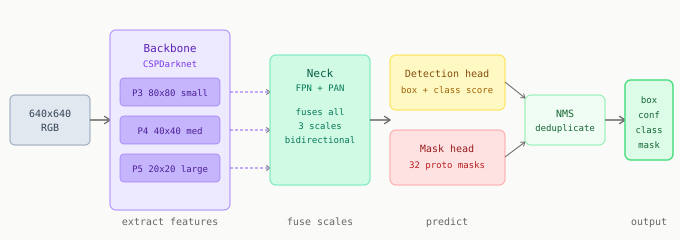

# Chapter 7: YOLO and Instance Segmentation

YOLOv8-seg is the model that solves the transparent bag problem. This chapter covers what the architecture does, how to read its output, and what you need to understand before training.

---

## Architecture overview

YOLOv8-seg processes a 640x640 image in three stages.



**Backbone (CSPDarknet)** extracts feature maps at three scales:

| Scale | Grid | Good at detecting |
|-------|------|------------------|
| P3 | 80x80 | Small objects, fine edges |
| P4 | 40x40 | Medium objects |
| P5 | 20x20 | Large objects, global context |

All three scales matter for transparent bags: fine features find the bag edge, coarse features understand that there is an object even when the bag is nearly invisible.

**Neck (FPN + PAN)** fuses all three scales bidirectionally. Every scale receives information from every other scale before the final prediction.

**Dual head** produces two outputs per detection:
- Detection: bounding box coordinates and class probabilities
- Segmentation: 32 prototype masks plus one coefficient vector per detection. The final mask is a linear combination of the 32 prototypes. This approach is far faster than predicting a full-resolution mask directly.

After the head, NMS (Non-Maximum Suppression) removes duplicate detections.

---

## Reading the output

```python
from ultralytics import YOLO
import numpy as np

model   = YOLO('best.pt')
results = model('cookie_bag.jpg', conf=0.5, verbose=False)
r       = results[0]

print(f"{len(r.boxes)} detections")

for i in range(len(r.boxes)):
    conf     = float(r.boxes.conf[i])
    cls_name = r.names[int(r.boxes.cls[i])]
    mask     = r.masks.data[i].cpu().numpy()   # (H, W) float32, 0 to 1

    ys, xs = np.where(mask > 0.5)
    u = int(xs.mean())
    v = int(ys.mean())

    print(f"  {cls_name:<20} conf={conf:.2f}  centroid=({u},{v})")
```

Three things require `.cpu()` before `.numpy()`: YOLO stores tensors on GPU. Calling `.numpy()` directly on a GPU tensor raises an error.

`verbose=False` is not optional in a robot node. Without it, YOLO prints a detection table to stdout on every inference call: 30 lines per second, unusable.

---

## Pretrained versus fine-tuned

`yolov8m-seg.pt` was trained on COCO: 118,000 images, 80 classes. It knows nothing about cookies in transparent bags.

The value of the pretrained weights is not its class knowledge. It is the backbone's learned understanding of edges, textures, and spatial relationships. Fine-tuning starts from this understanding and adjusts the weights to recognise your specific objects. This is why fine-tuning on 200 images produces a good detector, while training from scratch on 200 images produces noise.

---

## Model size

| Variant | Parameters | GPU latency | Recommendation |
|---------|-----------|-------------|----------------|
| yolov8n-seg | 3.4M | 5ms | Prototyping |
| yolov8s-seg | 11.8M | 8ms | Balanced |
| yolov8m-seg | 27.3M | 18ms | Production default |
| yolov8l-seg | 46.0M | 28ms | If m is not accurate enough |

For a 100ms latency budget: yolov8m-seg at 18ms leaves 82ms for depth processing, pose computation, and publishing. Start with m. If your GPU cannot handle it, use s.

---

[Prev: Chapter 6](06_limits_of_classical_cv.md) | [Next: Chapter 8](08_building_your_dataset.md)
