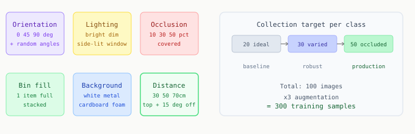

# Chapter 8: Building Your Dataset

A mediocre model trained on an excellent dataset beats an excellent model trained on a mediocre dataset. Every time. This chapter is about building the dataset that determines everything else.

---

## How many images you need

| Images per class | Expected outcome |
|-----------------|-----------------|
| Less than 50 | Detects only under near-ideal conditions |
| 50 to 100 | Functional, fails under unusual lighting or angles |
| 100 to 200 | Good generalization, target for initial training |
| 200 to 500 | Strong, appropriate for production |

Start with 80 to 120 per class. Evaluate after training. Collect more if detection rate is below 95%.

---

## The six axes of diversity

A model trained only on ideal conditions fails in production, because production is never ideal.



Deliberately capture variation across all six. For the transparent cookie bag, orientation and background variation are especially important: the bag's apparent texture changes dramatically with both.

---

## Capturing images from the RealSense

```python
import pyrealsense2 as rs
import numpy as np
import cv2
import os

SAVE_DIR = "dataset/raw"
os.makedirs(SAVE_DIR, exist_ok=True)

pipeline = rs.pipeline()
config   = rs.config()
config.enable_stream(rs.stream.color, 640, 480, rs.format.bgr8, 30)
pipeline.start(config)

count = len(os.listdir(SAVE_DIR))
print(f"Starting from frame {count}. SPACE to save, Q to quit.")

try:
    while True:
        frame = pipeline.wait_for_frames().get_color_frame()
        if not frame:
            continue
        img = np.asanyarray(frame.get_data())
        cv2.imshow('Capture', img)
        key = cv2.waitKey(1)
        if key == ord('q'):
            break
        if key == ord(' '):
            path = os.path.join(SAVE_DIR, f"frame_{count:04d}.jpg")
            cv2.imwrite(path, img)
            print(f"  Saved {path}")
            count += 1
finally:
    pipeline.stop()
    cv2.destroyAllWindows()
```

One frame every 2-3 seconds of deliberate change. Ten nearly identical frames add less than one frame from a new angle.

---

## Labeling with Roboflow

Upload to [roboflow.com](https://roboflow.com). Create an **Instance Segmentation** project.

Use the Smart Polygon tool. For transparent bags: trace the plastic boundary, not the cookie inside. The gripper grasps the bag. The contents are irrelevant.

**The single most important rule:** label every visible instance in every image, including partially occluded ones. A model that never sees partially occluded training examples will fail on partially occluded objects in production.

---

## Augmentations

Before export, configure augmentations:

```
Flip:       horizontal and vertical
Rotation:   plus or minus 30 degrees
Brightness: plus or minus 25 percent
Blur:       up to 1.5px
Noise:      up to 1 percent of pixels
```

With 3x augmentation multiplier, 100 raw images becomes 300 training samples.

Do not add cutout or extreme saturation augmentations. These can remove the only visible edge of a transparent bag.

---

## Export and validate

Export as **YOLOv8 (Segmentation)** format. Then validate before training:

```python
from pathlib import Path
import yaml

def validate_dataset(root):
    root = Path(root)
    cfg  = yaml.safe_load((root / 'data.yaml').read_text())

    print(f"Classes: {cfg['names']}")

    for split in ['train', 'valid', 'test']:
        imgs   = list((root / split / 'images').glob('*.jpg'))
        labels = list((root / split / 'labels').glob('*.txt'))
        print(f"\n{split}: {len(imgs)} images, {len(labels)} labels")

        if len(imgs) != len(labels):
            print("  WARNING: image and label count differ")

        counts = {i: 0 for i in range(cfg['nc'])}
        for lp in labels:
            for line in lp.read_text().strip().split('\n'):
                if line.strip():
                    counts[int(line.split()[0])] += 1

        for cls_id, n in counts.items():
            bar = 'X' * (n // 5)
            print(f"  {cfg['names'][cls_id]:<25} {n:4d}  {bar}")

validate_dataset('dataset')
```

Before training you want balanced class counts (no class worse than 3:1 imbalance) and matching image and label counts per split.

---

[Prev: Chapter 7](07_yolo_and_segmentation.md) | [Next: Chapter 9](09_fine_tuning.md)
