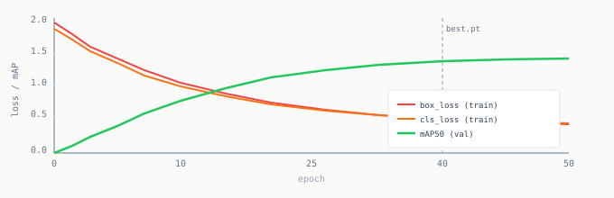

# Chapter 9: Fine-Tuning

Fine-tuning takes the pretrained YOLOv8 weights and adjusts them to recognize your specific objects. The backbone already understands how to look at the world. You are teaching it new categories, not how to see.

---

## What the training loop does

For each epoch:

1. Sample a batch of images with their labels
2. Run each image through the network (forward pass)
3. Compute three losses: box accuracy, class accuracy, mask accuracy
4. Propagate gradients backward (backpropagation)
5. Update weights slightly in the direction that reduces total loss
6. At epoch end: run validation split, compute mAP, save weights if best so far

Repeat until validation loss stops improving.



---

## Key hyperparameters

Most defaults are fine. Four require attention:

| Parameter | Value | Why |
|-----------|-------|-----|
| `lr0` | 0.001 | Lower than default 0.01. High LR destroys pretrained features. |
| `epochs` | 50 | Enough for fine-tuning. Train longer only if mAP is still climbing. |
| `patience` | 20 | Stop if no improvement for 20 epochs. Use best weights found. |
| `batch` | 8 | Reduce to 4 if CUDA runs out of memory. |

---

## Training script

```python
import torch
from pathlib import Path
from ultralytics import YOLO
import yaml

DATASET  = Path("dataset")
PROJECT  = "runs/train"
RUN_NAME = "cookie-bag-v1"

def fix_dataset_path(root):
    cfg_path = root / "data.yaml"
    cfg = yaml.safe_load(cfg_path.read_text())
    cfg['path'] = str(root.resolve())   # Roboflow exports relative path, YOLO needs absolute
    cfg_path.write_text(yaml.dump(cfg))
    return cfg

def train():
    if torch.cuda.is_available():
        name = torch.cuda.get_device_name(0)
        mem  = torch.cuda.get_device_properties(0).total_memory / 1e9
        print(f"GPU: {name}  ({mem:.1f} GB)")
    else:
        print("WARNING: no GPU found, training will be slow")

    cfg   = fix_dataset_path(DATASET)
    model = YOLO('yolov8m-seg.pt')

    model.train(
        data          = str(DATASET / "data.yaml"),
        epochs        = 50,
        imgsz         = 640,
        batch         = 8,
        lr0           = 0.001,
        lrf           = 0.01,
        warmup_epochs = 3,
        patience      = 20,
        val           = True,
        plots         = True,
        project       = PROJECT,
        name          = RUN_NAME,
        exist_ok      = True,
    )

def evaluate():
    best = Path(PROJECT) / RUN_NAME / "weights" / "best.pt"
    assert best.exists(), f"best.pt not found at {best}"

    model = YOLO(str(best))
    val_r = model.val(data=str(DATASET / "data.yaml"), split="val", conf=0.5)

    print(f"mAP50 box:  {val_r.box.map50:.4f}")
    print(f"mAP50 mask: {val_r.seg.map50:.4f}")
    return val_r

if __name__ == "__main__":
    train()
    evaluate()
```

---

## Reading the training output

Every epoch prints:

```
Epoch   GPU_mem   box_loss  cls_loss  seg_loss
  1/50    3.2G      1.842     2.104     1.631
  5/50    3.2G      1.441     1.654     1.287
 25/50    3.2G      0.621     0.443     0.534
```

All three losses should decrease. If `cls_loss` stays above 1.5 after epoch 10, check your labels: class ID mismatches or inconsistent annotation style are the most common cause.

---

## Understanding mAP50

A predicted mask counts as correct if it overlaps the ground truth by at least 50%.

| mAP50 | Interpretation |
|-------|---------------|
| above 0.90 | Ready for integration |
| 0.75 to 0.90 | Functional, tuning recommended |
| 0.50 to 0.75 | More data or relabeling needed |
| below 0.50 | Something fundamentally wrong |

If you are below 0.75: first check labels in Roboflow (are all instances labeled? is the bag boundary traced correctly?). Then collect 30 more images focused on the conditions where the model fails.

---

## The overfitting diagnostic

Healthy: validation mAP climbs steadily, training loss falls in parallel.

Overfitting: training loss keeps falling, validation mAP flattens or drops. The model is memorizing training images instead of learning general features. Early stopping catches this automatically. The underlying fix is more data or more diverse augmentation.

---

[Prev: Chapter 8](08_building_your_dataset.md) | [Next: Chapter 10](10_ros2_pipeline.md)
