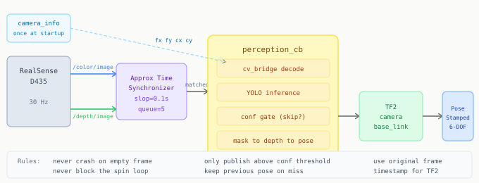

# Chapter 10: The ROS 2 Pipeline

Everything in Chapters 1-9 was offline: files in, results out, scripts that run once and stop. Chapter 10 is where it becomes a running system.

---

## The architecture decision: always-on perception

The perception node runs continuously, not on demand. It does not wait to be asked for a grasp pose. Whenever it produces a high-confidence detection it publishes a fresh pose to a topic. The robot reads that topic whenever a pick begins.

This means no detection latency at pick time: the pose was already computed before the pick started. Perception and execution are fully decoupled.



---

## Key ROS 2 concepts

**Topics** are named channels. Any node can publish or subscribe. Publisher and subscriber do not know about each other.

**`ApproximateTimeSynchronizer`** pairs messages from two topics by timestamp. The RGB and depth cameras publish on separate topics at slightly different times. Without synchronization you might pair an RGB frame from one moment with a depth frame from 100ms later.

**`cv_bridge.CvBridge`** converts between `sensor_msgs/Image` (ROS format) and NumPy arrays (OpenCV format). Always specify the encoding string explicitly:

```python
rgb   = bridge.imgmsg_to_cv2(rgb_msg,   'bgr8')   # 3-channel uint8 BGR
depth = bridge.imgmsg_to_cv2(depth_msg, '16UC1')  # 1-channel uint16 millimeters
```

Wrong encoding gives silently corrupted pixel values.

---

## The complete node

```python
import rclpy
from rclpy.node import Node
from sensor_msgs.msg import Image, CameraInfo
from geometry_msgs.msg import PoseStamped
import message_filters
from cv_bridge import CvBridge
from ultralytics import YOLO
from scipy.spatial.transform import Rotation
import numpy as np
import cv2
import tf2_ros
import tf2_geometry_msgs

WEIGHTS     = "/path/to/best.pt"
CONF_THRESH = 0.50
KNOWN_BOX_Z = 0.45   # camera to bin floor in metres, measure once


class PerceptionNode(Node):

    def __init__(self):
        super().__init__('perception_node')
        self.bridge     = CvBridge()
        self.model      = YOLO(WEIGHTS)
        self.intrinsics = None
        self.tf_buffer  = tf2_ros.Buffer()
        self.tf_listener = tf2_ros.TransformListener(self.tf_buffer, self)
        self.get_logger().info("Model loaded, waiting for camera info")

        self.create_subscription(
            CameraInfo, '/camera/color/camera_info',
            self._camera_info_cb, 10)

        rgb_sub   = message_filters.Subscriber(self, Image, '/camera/color/image_raw')
        depth_sub = message_filters.Subscriber(self, Image, '/camera/depth/image_raw')
        self.sync = message_filters.ApproximateTimeSynchronizer(
            [rgb_sub, depth_sub], queue_size=5, slop=0.1)
        self.sync.registerCallback(self._perception_cb)

        self.pub = self.create_publisher(PoseStamped, '/best_grasp_pose', 10)

    def _camera_info_cb(self, msg):
        if self.intrinsics is None:
            self.intrinsics = {
                'fx': msg.k[0], 'fy': msg.k[4],
                'cx': msg.k[2], 'cy': msg.k[5],
            }
            self.get_logger().info(f"Intrinsics received: fx={self.intrinsics['fx']:.1f}")

    def _perception_cb(self, rgb_msg, depth_msg):
        if self.intrinsics is None:
            return

        rgb   = self.bridge.imgmsg_to_cv2(rgb_msg,   'bgr8')
        depth = self.bridge.imgmsg_to_cv2(depth_msg, '16UC1')

        results = self.model(rgb, conf=CONF_THRESH, verbose=False)
        r = results[0]

        if r.masks is None or len(r.boxes) == 0:
            return   # no detection, keep previous published pose

        best_idx  = int(r.boxes.conf.argmax())
        best_mask = r.masks.data[best_idx].cpu().numpy()
        best_conf = float(r.boxes.conf[best_idx])

        pose_cam = self._mask_to_camera_pose(best_mask, depth, rgb_msg.header)
        if pose_cam is None:
            return

        pose_base = self._to_base_link(pose_cam)
        if pose_base is None:
            return

        self.pub.publish(pose_base)
        self.get_logger().debug(f"conf={best_conf:.2f}  Z={pose_base.pose.position.z:.3f}")

    def _mask_to_camera_pose(self, mask, depth, header):
        fx = self.intrinsics['fx'];  fy = self.intrinsics['fy']
        cx = self.intrinsics['cx'];  cy = self.intrinsics['cy']

        ys, xs = np.where(mask > 0.5)
        if len(xs) == 0:
            return None

        u = int(xs.mean());  v = int(ys.mean())

        hole_ratio = (depth == 0).mean()
        if hole_ratio > 0.30:
            d = KNOWN_BOX_Z
        else:
            half  = 3
            roi   = depth[max(0,v-half):v+half+1, max(0,u-half):u+half+1]
            valid = roi[roi > 0]
            d     = float(np.median(valid)) / 1000.0 if len(valid) else KNOWN_BOX_Z

        binary  = (mask > 0.5).astype(np.uint8) * 255
        cnts, _ = cv2.findContours(binary, cv2.RETR_EXTERNAL, cv2.CHAIN_APPROX_SIMPLE)
        yaw_deg = 0.0
        if cnts:
            cnt = max(cnts, key=cv2.contourArea)
            _, (w, h), angle = cv2.minAreaRect(cnt)
            yaw_deg = angle + 90.0 if w < h else angle

        rot = Rotation.from_euler('z', np.radians(yaw_deg))
        qx, qy, qz, qw = rot.as_quat()

        X = (u - cx) * d / fx
        Y = (v - cy) * d / fy

        pose = PoseStamped()
        pose.header.frame_id = 'camera_color_optical_frame'
        pose.header.stamp    = header.stamp   # use original frame timestamp for TF2
        pose.pose.position.x = float(X)
        pose.pose.position.y = float(Y)
        pose.pose.position.z = float(d)
        pose.pose.orientation.x = float(qx)
        pose.pose.orientation.y = float(qy)
        pose.pose.orientation.z = float(qz)
        pose.pose.orientation.w = float(qw)
        return pose

    def _to_base_link(self, pose_cam):
        try:
            tf = self.tf_buffer.lookup_transform(
                'base_link',
                pose_cam.header.frame_id,
                pose_cam.header.stamp,
                timeout=rclpy.duration.Duration(seconds=0.5))
            return tf2_geometry_msgs.do_transform_pose_stamped(pose_cam, tf)
        except Exception as e:
            self.get_logger().warn(f"TF2 failed: {e}")
            return None


def main(args=None):
    rclpy.init(args=args)
    node = PerceptionNode()
    try:
        rclpy.spin(node)
    except KeyboardInterrupt:
        pass
    finally:
        node.destroy_node()
        rclpy.shutdown()

if __name__ == '__main__':
    main()
```

---

## Verifying the node

```bash
ros2 launch realsense2_camera rs_launch.py

ros2 run your_package perception_node

ros2 topic echo /best_grasp_pose

ros2 topic hz /best_grasp_pose
```

A healthy node logs the intrinsics line, then publishes poses. Target publish rate is above 5 Hz. If you see the intrinsics log but no poses, either nothing is being detected above the confidence threshold, or the TF2 transform is not available.

Check the TF transform exists:

```bash
ros2 run tf2_ros tf2_echo base_link camera_color_optical_frame
```

If this hangs, publish a static transform for testing:

```bash
ros2 run tf2_ros static_transform_publisher \
  0.45 0.0 0.62   0.5 -0.5 0.5 -0.5 \
  base_link camera_color_optical_frame
```

The six numbers are x y z qx qy qz qw representing the camera position and orientation relative to the robot base.

---

[Prev: Chapter 9](09_fine_tuning.md) | [Next: Chapter 11](11_six_dof_grasping.md)
