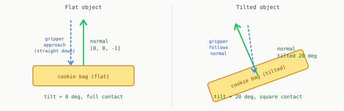

# Chapter 11: Six Degrees of Freedom

Chapter 10 publishes a pose with correct position and yaw. Two degrees of freedom are still missing: roll and pitch, the tilt of the object. A cookie bag leaning against the bin wall at 20 degrees requires a tilted gripper approach, or the gripper clips the edge.

This chapter adds tilt estimation using surface normals computed from the depth mask.

---

## The intuition

When a surface is tilted, its depth values vary across it. One edge is closer to the camera than the other. Back-projecting all the depth pixels inside the YOLO mask gives a small point cloud of the object's top surface. Fitting a plane to that cloud gives the surface normal: a unit vector perpendicular to the surface pointing toward the camera.

The angle between that normal and straight-up `[0, 0, -1]` is the tilt. The gripper approaches along the normal, not straight down.



---

## Computing the surface normal

```python
import numpy as np

def compute_surface_normal(mask, depth_img, intrinsics, min_points=50):
    """
    Back-project mask pixels with valid depth, fit a plane via PCA,
    return the surface normal vector or None if insufficient data.
    """
    fx = intrinsics['fx'];  fy = intrinsics['fy']
    cx = intrinsics['cx'];  cy = intrinsics['cy']

    ys, xs = np.where(mask > 0.5)
    depths  = depth_img[ys, xs].astype(float) / 1000.0
    valid   = (depths > 0.05) & (depths < 1.5)
    xs, ys, depths = xs[valid], ys[valid], depths[valid]

    if len(xs) < min_points:
        return None   # transparent bag: not enough depth, use fallback

    X = (xs - cx) * depths / fx
    Y = (ys - cy) * depths / fy
    pts = np.column_stack([X, Y, depths])

    centered = pts - pts.mean(axis=0)
    _, _, Vt = np.linalg.svd(centered, full_matrices=False)
    normal = Vt[-1]   # last right singular vector = direction of minimum variance = normal

    if normal[2] > 0:
        normal = -normal   # orient toward camera

    return normal / np.linalg.norm(normal)
```

The key step: SVD on the centered point cloud. The last row of `Vt` (smallest singular value) is perpendicular to the plane, which is exactly the surface normal.

---

## Converting the normal to a quaternion

```python
from scipy.spatial.transform import Rotation

def normal_to_approach_quaternion(normal, yaw_rad=0.0):
    """
    Compute gripper approach quaternion aligned with surface normal.
    Falls back to vertical approach if normal is None or tilt exceeds 40 deg.
    Returns (qx, qy, qz, qw).
    """
    if normal is None:
        rot = Rotation.from_euler('z', yaw_rad)
        return tuple(rot.as_quat())

    approach = np.array([0.0, 0.0, 1.0])   # default gripper direction
    target   = -normal                       # into the surface

    dot  = float(np.clip(np.dot(approach, target), -1.0, 1.0))
    tilt = np.arccos(dot)

    if tilt > np.radians(40):
        rot = Rotation.from_euler('z', yaw_rad)
        return tuple(rot.as_quat())

    axis = np.cross(approach, target)
    norm = np.linalg.norm(axis)
    if norm < 1e-6:
        rot = Rotation.from_euler('z', yaw_rad)
        return tuple(rot.as_quat())

    tilt_rot = Rotation.from_rotvec(axis / norm * tilt)
    yaw_rot  = Rotation.from_euler('z', yaw_rad)
    rot      = tilt_rot * yaw_rot
    return tuple(rot.as_quat())
```

The 40-degree cap matters. When the transparent bag produces only scattered valid depth pixels, the fitted normal can point in a wrong direction. Capping at 40 degrees ensures a bad normal falls back to vertical approach rather than commanding an impossible orientation.

---

## Integrating into the node

Replace the quaternion line in `_mask_to_camera_pose` from Chapter 10:

```python
normal  = compute_surface_normal(mask, depth, self.intrinsics)
qx, qy, qz, qw = normal_to_approach_quaternion(
    normal, yaw_rad=np.radians(yaw_deg))
```

---

## Graceful degradation for transparent objects

For a flat opaque object: `compute_surface_normal` returns a near-vertical normal, the tilt quaternion is close to the yaw-only result from Chapter 10.

For the transparent bag: `compute_surface_normal` often returns `None` because fewer than 50 valid depth pixels exist inside the mask. The function falls back to yaw-only (vertical approach). This is correct: without reliable tilt information, vertical is the safest approach.

When the bag is leaning against a wall there may be 50 to 200 valid pixels along the visible portion of the bag surface. The normal estimate from this small sample is noisy but directionally correct. The 40-degree cap handles the worst cases.

Full 6-DOF when depth is good. 4-DOF (position + yaw) when depth is sparse. The system adapts to its sensing conditions.

---

[Prev: Chapter 10](10_ros2_pipeline.md) | [Next: Epilogue](12_epilogue.md)
